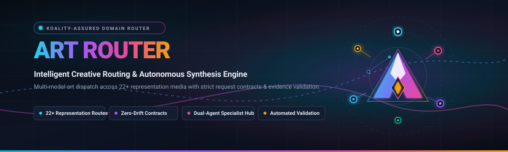
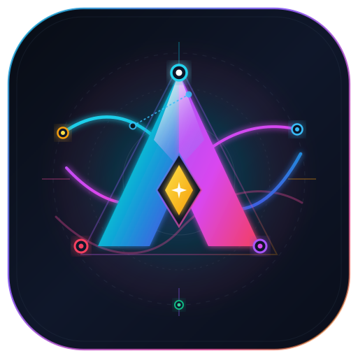
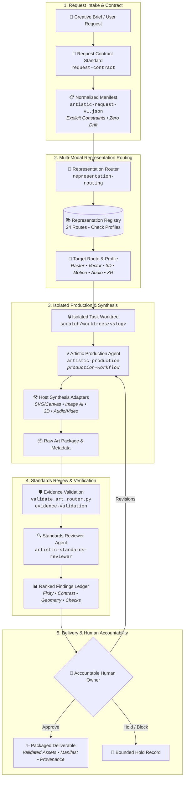

<div align="center">



<br/><br/>



# Art Router

**Domain AI harness router for multi-modal artistic generation, vector craftsmanship, and governed creative synthesis.**

[](https://github.com/Koality-Assured/art-router/actions/workflows/ci.yml)
[](https://github.com/Koality-Assured/art-router/blob/main/LICENSE)
[](https://www.python.org/)
[]()

</div>

---

## Overview

**Art Router** is the domain-specialized AI orchestration router for creative generation and media synthesis within the Koality-Assured ecosystem. It governs end-to-end creative workflows across **24 distinct representation routes**—from precision vector SVG, responsive web assets, and raster illustration, to CGI/3D concepts, procedural animation, audio/haptics, and spatial XR.

Built upon a strict governance foundation, Art Router enforces a core tenet: **"A route is a starting point, not a verdict."** Every creative assignment begins with a normalized, zero-drift request contract, proceeds through isolated worktree production, and undergoes rigorous offline evidence validation before human handoff.

### Why Art Router?

- **24 Comprehensive Representation Routes**: Machine-readable media definitions with dedicated preflight check profiles.
- **Zero-Drift Request Contracts**: Normalizes briefs into verifiable schema constraints; missing fields stay `unknown` rather than hallucinated.
- **Dual-Agent Specialist Hub**: Decouples mutating artwork synthesis (`artistic-production`) from read-only governance and evidence auditing (`artistic-standards-reviewer`).
- **Sandboxed Worktree Execution**: All creative iterations run in isolated Git worktrees (`scratch/worktrees/<slug>`), keeping `main` pristine.
- **Offline Evidence Validation**: Fully local validator checking geometry, viewBox, colorimetry, fixity checksums, and contract fulfillment without third-party leaks.

---

## Architecture & Lifecycle

Art Router organizes creative execution into a five-stage pipeline:



### The 5 Operational Phases

1. **Request Intake & Contract**: Converts messy briefs, sketches, or conversational prompts into an immutable [`artistic-request-v1.json`](./docs/standards/artistic-request-v1.schema.json) contract via [`request-contract`](./ai-tooling/skills/artistic/request-contract/SKILL.md).
2. **Representation Routing**: Dynamically resolves media routes, adjacent fallback routes, and required check profiles via [`representation-routing`](./ai-tooling/skills/artistic/representation-routing/SKILL.md) and [`artistic-representation-registry.json`](./docs/standards/artistic-representation-registry.json).
3. **Isolated Production**: The [`artistic-production`](./ai-tooling/agents/artistic-production/AGENT.md) specialist generates or modifies artwork inside an isolated worktree via [`production-workflow`](./ai-tooling/skills/artistic/production-workflow/SKILL.md).
4. **Evidence Validation**: The [`artistic-standards-reviewer`](./ai-tooling/agents/artistic-standards-reviewer/AGENT.md) executes offline verification via [`validate_art_router.py`](./scripts/validation/validate_art_router.py) and [`evidence-validation`](./ai-tooling/skills/artistic/evidence-validation/SKILL.md).
5. **Handoff & Human Review**: An accountable human owner makes final release and aesthetic determinations. Agents record findings but never fabricate release authority.

---

## 24 Representation Routes

Art Router categorizes all artistic mediums in [`docs/standards/artistic-representation-registry.json`](./docs/standards/artistic-representation-registry.json), each paired with normative verification controls:

| Route ID | Medium & Standard Family | Key Asset Types | Verification Profile & Controls |
| :--- | :--- | :--- | :--- |
| `illustration` | Painting & 2D Illustration | `raster`, `illustration`, `painting` | Dimensions, color profile, equivalent description |
| `graphic_design` | Graphic Design & Minimalism | `graphic_design`, `poster`, `vector_poster` | WCAG contrast, reading order, design handoff |
| `logos_icons` | Logos, Icons & Favicons | `vector`, `favicon`, `icon`, `app_mark`, `touch_icon` | Small-size exports, monochrome behavior, accessible name |
| `typography` | Typography & Lettering | `font`, `typography` | Font format, glyph coverage, readability, text layers |
| `photography` | Photography & Editorial | `raster`, `photograph`, `editorial_photo` | Capture scale, lens focal length, edit history |
| `collage` | Collage & Assemblage | `collage_raster`, `collage_vector` | Source inventory, license records, transformation notes |
| `raster_vector_sprites`| Raster, Vector & Pixel Sprites | `raster`, `vector`, `sprite_sheet` | Sheet dimensions, frame count, grid pitch, pixel filters |
| `web` | Websites & Creative UI | `web`, `open_graph_image` | Keyboard navigation, focus states, reduced motion, fallback |
| `tattoo` | Tattoos & Body Art | `vector` | Placement, line weight, skin aging, non-body preview |
| `print` | Print, Packaging & Merch | `print`, `packaging` | Page count, trim, bleed, CMYK profile, PDF preflight |
| `animation` | Animation, Video & Projection | `video` | Duration, frame rate, time alternatives, seizure flash check |
| `cgi` | CGI, 3D & VFX | `3d_scene` | Scene format, frame range, camera, lighting, render units |
| `audio_haptic` | Audio & Haptic Patterns | `audio`, `haptic_pattern` | Sample rate, bit depth, loudness, transcript, haptic safety |
| `installation` | Public Art & Signage | `installation` | Venue access, egress, structural load, hazard plans |
| `data_visualization` | Data & Info Visualization | `data_visualization` | Data source, units, legend, precision, non-color meaning |
| `participatory` | Participatory & Social Work | `participatory_work` | Participant consent, attribution, data minimization |
| `xr` | XR, AR & VR Experiences | `software` | Tracking runtime, frame rate, comfort scale, 2D fallback |
| `literary` | Literary, Textual & Poetic | `text` | Word count, language, reading level, alternate formats |
| `performance` | Performance, Theatre & Dance | `performance` | Cue sheet, cast, access requirements, venue capture |
| `music` | Music Composition & Sound | `music` | Stems, score notation, loudness target, audio format |
| `physical` | Sculpture, Ceramics & Textiles | `physical` | Material specs, fabrication tolerance, handling guides |
| `comics` | Comics & Sequential Narrative | `raster` | Panel counts, reading sequence, extractable typography |
| `games` | Games & Interactive Fiction | `software` | Build target, platform inputs, pause/save state controls |
| `cartographic_art` | Cartographic & Geospatial Art | `raster` | Projection, CRS, scale bar, orientation, source date |

---

## Specialist Agents & Skill Ecosystem

Art Router strictly enforces operator discipline through dedicated Schema V2 agent and skill pairings:

### Specialist Agents

- [`artistic-production`](./ai-tooling/agents/artistic-production/AGENT.md) (`mutate` / `read-only`):
  Write-capable synthesis specialist. Operates in isolated task worktrees to produce vector artwork, package raster assets, run conversion tools, and emit manifest updates.
- [`artistic-standards-reviewer`](./ai-tooling/agents/artistic-standards-reviewer/AGENT.md) (`read-only`):
  Read-only governance auditor. Evaluates deliverables against representation controls, executes verification scripts, generates ranked findings ledgers, and surfaces human-review boundaries.

### Core Artistic Skills

- [`request-contract`](./ai-tooling/skills/artistic/request-contract/SKILL.md):
  Normalizes loose creative requests into structured, schema-compliant contract records. Evaluates host capability constraints, logs deviation ledgers, and prevents prompt drift.
- [`representation-routing`](./ai-tooling/skills/artistic/representation-routing/SKILL.md):
  Maps normalized intent to exact representation routes, adjacent fallbacks, and check profiles from the registry.
- [`production-workflow`](./ai-tooling/skills/artistic/production-workflow/SKILL.md):
  Drives asset generation and modification within isolated worktrees, applying declared host tool adapters (SVG, Pillow, Blender, ffmpeg, AI generators).
- [`evidence-validation`](./ai-tooling/skills/artistic/evidence-validation/SKILL.md):
  Executes offline evidence auditing, verifies sha256 fixity, cross-checks declared metadata against actual deliverables, and flags holds.

---

## Quickstart & CLI Validation

All verification tooling runs locally without external dependencies or cloud credentials.

### 1. Validate Route Manifests

Run the primary validator against test cases or production manifests:

```bash
# Validate next-steps test cases with full JSON report
python scripts/validation/validate_art_router.py --manifest scripts/validation/fixtures/next-steps.json --json
```

Sample output:
```json
{
  "manifest_id": "art-router-next-steps-fixture",
  "status": "pass",
  "case_count": 7,
  "passed": 7,
  "held": 0
}
```

### 2. Validate Packaged Sample Gallery

Ensure all repository sample assets exist, match declared mime-types, and conform to route schemas:

```bash
python scripts/validation/validate_art_samples.py
```

### 3. Run Test Suite

Run the full unit test suite (300+ tests covering harness routing, art validators, and dispatch logic):

```bash
python -m unittest discover -s scripts/tests
```

---

## Repository Taxonomy

Art Router follows the standardized 12-area repository layout:

| Directory | Purpose & Operational Role |
| :--- | :--- |
| [`actionable/`](./actionable/) | **Intake zone** — Unprocessed creative briefs and human art requests. |
| [`ai-tooling/`](./ai-tooling/) | **Agent runtime** — Artistic skills, agent definitions, A2A protocols, and memory checkpoints. |
| [`assets/`](./assets/) | **Branding identity** — Vector logos, banners, and repository visual assets. |
| [`change-history/`](./change-history/) | **Audit logs** — Append-only quarterly changelogs managed exclusively via script. |
| [`docs/`](./docs/) | **Authoritative standards** — Representation matrix, request contract spec, and artistic practice guidelines. |
| [`projects/`](./projects/) | **Initiatives** — Structured creative initiatives, milestone specs, and campaign tracking. |
| [`references/`](./references/) | **External standards** — Advisory references (WCAG, SVG specs, Conventional Commits). |
| [`research/`](./research/) | **Explorations** — Deep-dives into novel generative models, renderers, and color theory. |
| [`results/`](./results/) | **Deliverables** — Generated art packages, validation ledgers, and delivery archives. |
| [`routing/`](./routing/) | **Dispatch layer** — Area maps, skill dispatch catalog, and hybrid routing tables. |
| [`scratch/`](./scratch/) | **Ephemeral work** — Task worktrees (`scratch/worktrees/`) and temporary scratch files. |
| [`scripts/`](./scripts/) | **Automation engine** — Python tools for validation, worktree spawning, and routing indexes. |
| [`supporting/`](./supporting/) | **Tool runtimes** — Guides for ast-grep, qmd, Headroom, Mermaid, and image utilities. |

---

## Operating Contracts & Governance

- **Human Accountability**: AI agents synthesize assets and report evidence; only accountable human owners grant release, legal, copyright, or ethical approval.
- **Traceable Provenance**: Models, prompts, seeds, host tools, and edit histories are permanently recorded in delivery manifests.
- **Privacy & Safety**: No unauthorized likenesses, confidential branding assets, or private training materials are submitted to external public APIs.
- **Zero-Drift Ingestion**: AI agents adhere strictly to [`AGENTS.md`](./AGENTS.md) and [`routing/AGENTS.md`](./routing/AGENTS.md), loading area context Just-In-Time (JIT) without preloading.

---

<div align="center">
<sub>Crafted with precision for the Koality-Assured domain routing ecosystem.</sub>
</div>
